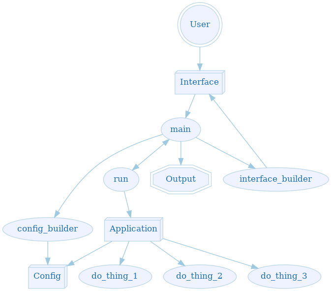

# Major Components

Even though the use case, capabilities, and implementation of all command line programs is almost
infinitely vast, they all share some common compenents. If we extract these components we can reuse
code between our various programs. It also provides a sort of blueprint for building our
applications in an efficient and effective manner.

The simplified components are:

 * Interface
 * Controller
 * Configuration / Context
 * Results
   * Output
   * Errors
 * Application Logic

The following is a diagram depicting common flow for command line applications in Rust. Don't be
alarmed if not everything doesn't make perfect sense yet. All will be explained shortly! Also, it's
important to note that different applications can take *slightly* different forms, but the basic
components remain roughly the same.

 